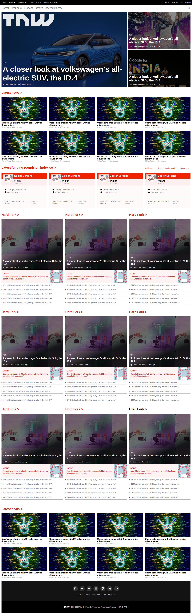

# THE NEXT WEB homepage

## Definition

We have used several techniques like flexbox, position, float and grid to layout our website and make it responsive. And it's about The New Web's Home Page.

## About the Project

This project is about building a responsive website using the various positioning and dispaly values from mobile view up to deskop. The website has two breakpoints 676px and 1023px

This project is about building a responsive website using the various positioning and dispaly values from mobile view up to deskop. The website has two breakpoints 676px and 1023px
The features of this project are listed below:

1. Website has a header containing:
    - Top Navbar not visible in mobile view
    - Navbar with logo and some hidden menu in mobile view
    - search icon
    - hambugger menu for mobile view
2. Has a banner section
    - Three main stories with pics
    - The banner items are links
3. Has a latest news section
    - News items in grid form
    - Responsive layout
4. Has a funding section
    - News items in grid form
    - responsive layout
4. Has a categories section
    - News items in grid form
    - responsive layout
4. Has a deals section
    - News items in grid form
    - responsive layout
5. Footer section with
    - with social icons
    - with logo and text

## Built With

- HTML5
- CSS3

## Live Demo

[Live Demo Link](https://misori-simon.github.io/building-with-responsive-design/)

## Getting Started

**Just clone this repo and open index.html file in your browser then you are good to go.**

**To get a local copy up and running follow these simple example steps.**

### clone the repo.

## Authors

👤 **Misori Simon**

- GitHub: [Misori-simon](https://github.com/Misori-simon/)
- Twitter: [@misori_simon](https://twitter.com/misori_simon)
- LinkedIn: [Misori Simon](https://cm.linkedin.com/in/misori-simon-05906219b)

👤 **Mohammed Naqhid**

- GitHub: [@Naqhid](https://github.com/Naqhid)s
- Twitter: [Naqhid](https://twitter.com/naqhid)
- LinkedIn: [Naqhid](https://www.linkedin.com/in/mohammed-naqhid-ab3080189/)

## 🤝 Contributing

Contributions, issues, and feature requests are welcome!

## Show your support

Give a ⭐️ if you like this project!

## Acknowledgments

- icons used from [iconify](https://iconify.design/)
- images used in this web pages are downloaded from [here](https://thenextweb.com/)

## 📝 License

This project is [MIT](./LICENSE) licensed.
